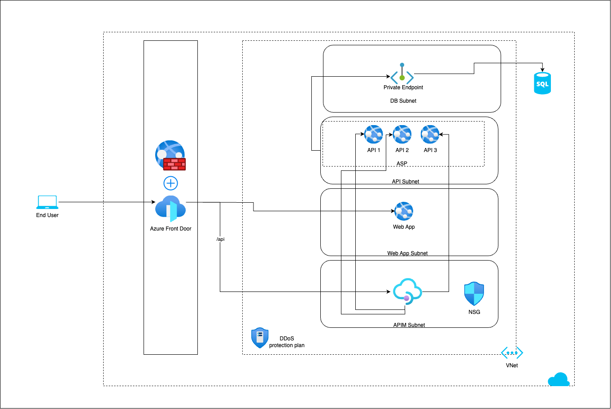

# Web application following 3 tier architecture

This example implements a 3-tier architecture web application on Azure. Following are the service used.

1. Azure Front Door
2. WAF
3. DDoS Protection Plan
4. VNet, Subnet, NSG
5. Azure Web App
6. Azure SQL Database
7. Private DNS Zones

Following is the architecture diagram that is implemented in Azure using Terraform

# Infrastructure design principles

Following are the principles considered while
designing it.
- Security – The architecture is designed to make sure the infrastructure provides good security.
    - enabling WAF on Front Door to make sure unwanted requests are blocked.
    - the database is securely accessed using private endpoint and it is not accessible over the internet.
    - APIM is using External VNet integration with restricted access only from Azure Front Door.
    - Azure web app containing the APIs are accessible only through private endpoint. And the public traffic is blocked.
    - Azure web app containing web application can be accessed only via Azure Front Door.
- High availability – The architecture is designed to make sure the infrastructure is highly
available by deploying web apps(Premium v2 or Premium v3) across multiple AZs.
- Serverless – To decrease maintenance and increase productivity, this design uses Azure services
where there are least admin tasks required.

# IaC design principles

- Code reusability – The modules are designed in a way keeping Atomic design, a methodology that helps
structure UI components, in mind. This helps create reusable Terraform modules and reduces duplication. Following is how the code is designed-
    - Atom – database, networking, webApp are written as atoms.
    - Molecules – The atoms defined above are stitched together to provide all three tiers.
    - Organism – All three molecules are stitched together to provide the end-to-end working
solution.

# Possible enhancements
This section talks about possible enhancements to the architecture design and its implementation in
Terraform.

- **Terraform code extension**
    - Implement Azure Front Door, WAF, DDoS protection plan and APIM in Terraform IaC.
    - Allow Windows based web apps
- **Rate limiting** - Add throttling on Azure Front Door using WAF.
- **Database credentials** - The Database crendentials are generated using Terraform random resource which can be stored to Key Vault for later consumption.
- **Logging**
    - Setup Azure Application Insights and instrument application code for distributed tracing.
    - Create Diagonstic Settings for all the resources and store the logs to Azure Log Analytics Workspace.
- **Monitoring**
    - Setup monitoring dashboards which shows the critical application metrics.
    - Setup notifications for any business critical failure.
- **Tagging**
    - Add tags to identify resources helpful in BI
- **Disaster Recovery**
    - Plan and implement the disaster recovery for the application